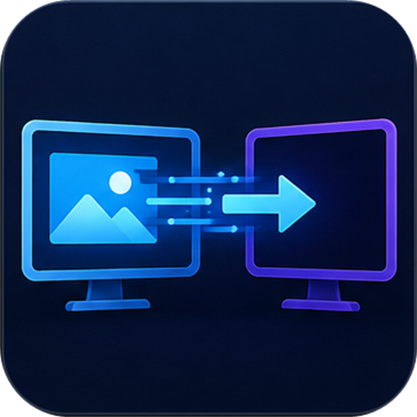

<div align="center">



# Presentation Display Manager

**Управление презентациями и медиаконтентом на нескольких экранах без суеты в эфире**

Оператор видит библиотеку, каналы и управление — зрители видят только готовый контент.

[](https://github.com/mirslava88/roland/releases/latest)

[](https://github.com/mirslava88/roland/releases/latest)
[](https://github.com/mirslava88/roland/actions/workflows/build-windows.yml)
[](https://github.com/mirslava88/roland/releases)
[](LICENSE)


</div>

---

## Что это

Presentation Display Manager — Windows-приложение для конференций, докладов, трансляций и мероприятий с несколькими экранами. Главное окно остаётся у оператора, основной контент выводится зрителям, а отдельные дисплеи при необходимости работают как суфлёр докладчика и информационное табло.

```text
Основной монитор — интерфейс оператора
Любой дополнительный монитор — эфир, копия эфира, суфлёр,
информационный экран, отдельный таймер или выключен
```

Один режим можно назначить нескольким мониторам: например, вывести эфир на два экрана или открыть одинаковый суфлёр для двух спикеров.

Приложение рассчитано на быстрые переключения: следующий материал можно подготовить в отдельном канале, не меняя текущую картинку в эфире.

## Основные возможности

- **Переключаемая сетка каналов** — раскладка 4 (2×2) для крупных превью или 9 (3×3) для одновременной работы с девятью каналами без прокрутки; дополнительные страницы позволяют заранее разложить ещё больше контента.
- **Автоматическое заполнение каналов** — кнопка **`123...->`** раскладывает все поддерживаемые материалы из открытой папки по номеру в начале имени: `3.pdf`, `03-Ролик.mp4`, `4. Презентация.pptx` и другие варианты. Недостающие страницы создаются автоматически, а файлы без номера остаются в библиотеке.
- **Подписи каналов** — карандаш в карточке позволяет подписать канал именем доклада, спикера или блока программы; подпись сохраняется независимо от замены материала и входит в конфигурацию.
- **Сохранение конфигурации мероприятия** — один файл `.pdmconfig` сохраняет материалы и подписи каналов, переходы после видео, номера слайдов, раскладку, назначения и имена дисплеев, подложку, информационный экран, плейлисты, позиции видео, таймер, кликер и аудиовыход.
- **Автопереход между презентациями** — по желанию клик «вперёд» на последнем слайде PPTX/PDF открывает ближайший следующий непустой канал, а клик «назад» на первом слайде — предыдущий. Пустые каналы пропускаются, функция при каждом запуске выключена.
- **Бесшовное переключение эфира** — PDF, PowerPoint, видео и внешние источники сменяют друг друга без чёрного кадра, рабочего стола и мерцания; предыдущий кадр остаётся видимым до полной готовности следующего.
- **PowerPoint** — превью всех слайдов, переход к нужному слайду, next/prev и нативное слайд-шоу через Microsoft PowerPoint. Сразу после добавления PPTX в канал PDM в фоне готовит превью и полноразмерные кадры, поэтому первый выход в эфир начинается быстрее; ход подготовки виден по метке **«Кэширование…»**. При выходе Roland закрывает только созданный им экземпляр PowerPoint, а уже открытое пользовательское окно возвращает в исходное состояние.
- **PDF и офисные документы** — быстрый показ тяжёлых PDF, прогрессивная загрузка миниатюр и кэширование кадров; комбинированный рендер через Windows.Data.Pdf, PDFium и резервный pdf.js автоматически обходит проблемные страницы. Также доступен предпросмотр Word и Excel через установленный Microsoft Office.
- **Видео без потери позиции и переход по окончании** — play/pause, stop, seek, громкость, повтор ролика или плейлиста и продолжение с сохранённого момента после переключения между каналами; для каждого видеоканала можно заранее выбрать канал, который автоматически выйдет в эфир после окончания ролика. После выхода в эфир видео ожидает ручного нажатия Play.
- **Камеры и платы видеозахвата** — добавление веб-камер, USB-камер и HDMI/USB-плат для показа камеры, Apple TV и других внешних источников. Для устройств видеозахвата можно отдельно выбрать связанный аудиовход.
- **Окна программ и экраны** — автоматический список открытых окон, показ браузера, Word, Excel, Проводника, командной строки или целого экрана. Свёрнутое окно развернётся только после нажатия **«В эфир»**; браузер при этом автоматически переходит в режим F11 и скрытно возвращается в обычный режим при выходе из эфира, не перекрывая операторское окно.
- **Курсор при показе окна** — когда оператор работает в PDM, курсор не попадает в миниатюру и эфир захваченного окна; при переходе в демонстрируемую программу используется привычный системный курсор Windows. Звук выбранной программы не захватывается.
- **Изображения и подложка** — выбранный фон применяется ко всем включённым дополнительным дисплеям. Обычно новая сессия начинается без фона, но его можно явно перенести вместе с сохранённой конфигурацией. На суфлёре фон служит чистой заглушкой, когда в эфире нет PPTX/PDF, и не просвечивает между блоками слайдов.
- **Таймер поверх эфира** — перетаскивание, масштабирование, прозрачность текста, звуковые сигналы и отдельные цвета для основного времени, последней минуты и перелимита.
- **Музыкальный плеер** — плейлист, громкость, переход между треками и режимы повтора.
- **Универсальные дисплеи** — каждому дополнительному монитору независимо назначается эфир, суфлёр, информационный экран, отдельный таймер или выключенное состояние; одинаковые режимы можно повторять, а каждому физическому экрану можно дать понятное пользовательское имя.
- **Живая копия эфира** — второй монитор с режимом «Основной эфир» зеркалирует главный выход вместе с PowerPoint-анимациями, видео и бесшовными переходами, но без повторного воспроизведения звука.
- **Суфлёр докладчика** — один или несколько дисплеев следуют за активной PPTX/PDF-презентацией и показывают текущий слайд, следующий слайд, номер и заметки PowerPoint.
- **Информационные экраны** — независимый синхронный показ PPTX, PDF, видео, изображения, внешнего видеовхода либо выбранного окна/экрана на одном или нескольких мониторах; у видео есть play/pause, stop, переход по времени и зацикливание, а содержимое не меняется при переключении каналов основного эфира.
- **Гибкий вывод таймера** — таймер выводится на мониторы с режимом «Таймер», а если таких мониторов нет — автоматически накладывается поверх основного эфира.
- **Масштаб Windows** — эфирное окно учитывает координаты и DPI выбранного дисплея, включая распространённый масштаб 150%.
- **Аудиовыход** — выбор устройства с корректным отображением русских названий.
- **Кликер** — глобальное управление слайдами стрелками и Page Up/Page Down.
- **Диагностика** — постоянный журнал с данными о дисплеях, PowerPoint, экспорте превью и воспроизведении медиа.

## Поддерживаемые форматы

| Тип | Форматы |
|---|---|
| Презентации | `.pptx`, `.ppt` |
| Документы | `.pdf`, `.doc`, `.docx`, `.xls`, `.xlsx`, `.txt`, `.rtf`, `.odt`, `.ods` |
| Видео | `.mp4`, `.mov`, `.avi`, `.webm`, `.mkv` |
| Изображения | `.jpg`, `.jpeg`, `.png`, `.gif`, `.bmp`, `.webp`, `.tiff`, `.tif`, `.svg` |
| Аудио | `.mp3`, `.wav`, `.ogg`, `.aac`, `.m4a`, `.flac`, `.wma` |
| Внешние источники | камеры и USB/HDMI-платы видеозахвата, окна программ, экраны |

> Фактическое воспроизведение конкретного видео- или аудиокодека зависит от поддержки Chromium и Windows, а не только от расширения файла.

## Установка

1. Скачайте актуальный `.exe` на странице [Releases](https://github.com/mirslava88/roland/releases/latest).
2. Запустите `Presentation Display Manager Setup x.x.x.exe`.
3. Выберите папку установки и завершите установку.
4. Подключите нужные мониторы или проекторы и включите в Windows режим **«Расширить»**.
5. Нажмите **«🖥 Экраны»** и выберите режим отдельно для каждого подключённого монитора.

CI-сборки публикуются без коммерческой цифровой подписи. Поэтому Windows SmartScreen может показать предупреждение «Неизвестный издатель»: нажмите **«Подробнее» → «Выполнить в любом случае»**, если установщик скачан из официального раздела Releases этого репозитория.

### Системные требования

- Windows 10/11 x64;
- хотя бы один внешний дисплей или проектор для полноценного эфирного режима; дополнительные мониторы нужны только для суфлёра и информационного экрана;
- Microsoft PowerPoint desktop для показа PPT/PPTX и создания превью слайдов;
- Microsoft Word/Excel desktop для предпросмотра соответствующих документов.

PDF, изображения, видео, музыка и таймер не требуют установленного PowerPoint.

## Как работать

1. Выберите папку с материалами в левой панели либо добавьте камеру, плату видеозахвата, окно программы или экран в разделе **«Внешние источники»**.
2. Выберите раскладку **4 · 2×2** или **9 · 3×3** и перетащите материал либо внешний источник в нужный канал. Значок кнопки показывает раскладку, на которую переключит следующий клик: 9 точек в режиме 2×2 и 4 квадрата в режиме 3×3. Кнопка `+` добавляет ещё одну страницу из 4 или 9 каналов.
3. При необходимости заранее выберите слайд или поставьте видео на нужную позицию.
4. Выберите канал с контентом — после этого станет доступна кнопка **«В эфир»**. Нажмите её или дважды щёлкните по каналу. Свёрнутое окно программы развернётся только на этом шаге.
5. Кнопка **«Выйти из эфира»** закрывает текущий материал. Если в этой сессии выбрана подложка, появится она; иначе внешний экран станет чёрным.

Для PPTX и PDF доступны стрелки и прямой ввод номера слайда. Позиции слайдов сохраняются отдельно для каждого файла. При переключении с поставленного на паузу видео на другой канал его позиция сохраняется до закрытия приложения.

Чтобы подготовить каналы сразу из одной папки, назовите материалы с номером канала в начале и нажмите **`123...->`** слева от кнопки **«Обзор»**. Распознаются, например, `3.pdf`, `03.mp4`, `1 - Доклад.pptx`, `4. Презентация.pdf` и `01-Заставка.jpg`; подходят все поддерживаемые типы файлов. Если целевой канал занят, PDM запросит подтверждение замены. Канал, который уже находится в эфире, не перезаписывается, а одинаковые номера после первого файла пропускаются.

Карандаш в правом верхнем углу карточки задаёт подпись канала. Текст располагается справа и растёт влево, поэтому номер и состояние канала остаются видимыми. Enter или щелчок вне поля сохраняет подпись, Escape отменяет изменение. PPTX после добавления в канал сразу начинает фоновую подготовку; статус **«Кэширование…»** исчезает, когда превью и полноразмерные слайды готовы.

В карточке видеоканала слева от кнопки **«В эфир»** находится список **«После»**. Выберите в нём любой другой непустой канал — после естественного окончания ролика PDM автоматически и бесшовно отправит этот канал в эфир. Значение **«Не переключать»** оставляет эфир на последнем кадре. Настройка относится к конкретному каналу и действует в текущей сессии.

Кнопка **«Автопереход»** находится между кнопками **«Видео»** и **«Подложка (Фон)»**. Когда она включена, переход вперёд с последнего слайда PPTX/PDF запускает ближайший следующий канал с контентом, а переход назад с первого слайда — ближайший предыдущий. Пустые каналы автоматически пропускаются. При каждом запуске PDM автопереход выключен.

## Сохранение и загрузка конфигурации

Откройте **Настройки → Конфиг** и нажмите **«Сохранить конфиг»**, чтобы сохранить подготовку мероприятия в файл `.pdmconfig`. Для восстановления выйдите из эфира, откройте ту же вкладку и нажмите **«Загрузить конфиг»**. Загрузка не запускает презентацию, видео, музыку или таймер автоматически — оператор сам выбирает канал и нажимает **«В эфир»**.

PDM проверяет каждый путь перед восстановлением. Если презентацию, PDF, видео или другой файл удалили либо переименовали, программа не пытается угадать новый файл: соответствующий канал остаётся пустым, остальные каналы загружаются как обычно, а пропущенный путь показывается в списке предупреждений. Подписи каналов при этом сохраняются. USB-камеры и платы видеозахвата сохраняются и автоматически переподключаются при возвращении устройства; окна программ и захват экрана нужно выбрать заново, поскольку их системные идентификаторы меняются. Назначения дисплеев применяются только к безопасно распознанным подключённым мониторам.

## Несколько дисплеев

Кнопка **«🖥 Экраны»** показывает все подключённые дополнительные мониторы. Для каждого выбирается один режим:

- **Основной эфир** — один монитор является выделенным главным выходом, остальные показывают его живую беззвучную копию; главный дисплей можно переназначить кнопкой **«Сделать главным»**, в том числе во время эфира;
- **Суфлёр** — текущий и следующий слайды PPTX/PDF, номер и заметки PowerPoint;
- **Информационный экран** — независимый PPTX, PDF, видеоролик, изображение, плата видеозахвата/камера либо окно/экран компьютера;
- **Таймер** — полноэкранный таймер;
- **Выключен** — на монитор выводится выбранная подложка, а при её отсутствии показывается чёрный экран.

Режимы можно повторять на любом количестве мониторов. При отключении устройства его окно закрывается и не переносится на операторский экран.

В поле **«Добавить имя экрана»** можно подписать каждый физический монитор, например «Проектор сцены», «Суфлёр спикера» или «Таймер». Имена сохраняются между запусками и входят в файл конфигурации PDM.

### Информационные экраны

1. Назначьте одному или нескольким мониторам режим **«Информационный экран»** в окне **«🖥 Экраны»**.
2. Выберите источник: **«Выбрать файл»** для PPT/PPTX, PDF, видео и изображений; **«Внешний источник»** для платы видеозахвата или USB-камеры; **«Окно / экран»** для открытой программы или целого дисплея.
3. Для презентации или PDF используйте отдельные стрелки и счётчик слайдов. Это не переключает презентацию в основном эфире.
4. Видеоролик не запускается автоматически. Кнопка меняется между **«Воспроизвести»** и **«Пауза»**; **«Стоп»** останавливает ролик и возвращает его в начало, полоса с таймингом позволяет перейти к нужному месту, а **«Зациклить»** включает повтор. Внешний видеовход и захват окна/экрана начинают показываться сразу после выбора, без передачи звука.
5. Кнопка **«Отключить контент на информационном экране»** останавливает в том числе видеозахват и возвращает общую подложку, а если она не выбрана — чёрный фон.

Выбранный файл или источник действует только в текущей сессии PDM, если оператор явно не сохранил его в конфигурацию. Таймер не заменяет содержимое информационных экранов: он показывается на мониторах с режимом «Таймер», а при их отсутствии — поверх основного эфира.

## Таймер

Таймер выводится на один или несколько мониторов с режимом «Таймер», назначенным в окне «Экраны». Если такой монитор не назначен, таймер автоматически накладывается поверх основного эфира. Доступны:

- длительность и быстрые поправки `±1`, `±5`, `±10` минут;
- прозрачность текста;
- **цвет основного таймера**;
- **цвет за одну минуту до окончания**;
- **цвет перелимита времени**;
- отдельные звуковые сигналы на отметках 1:00 и 0:00.

Положение, масштаб и оформление сохраняются. Текущее время и выбранные звуки начинаются заново при каждом запуске.

## Диагностика

Если на конкретном компьютере не создаются превью PPTX, появляется чёрный экран или некорректно определяется монитор:

1. Запустите приложение и воспроизведите проблему.
2. Откройте **Настройки → Диагностика**.
3. Нажмите **«Открыть папку логов»**.
4. Передайте файл `pdm-diagnostic.log` разработчику.

Лог содержит версии приложения, Windows, Electron и Office, параметры экранов и DPI, этапы запуска PowerPoint, экспорт превью и ошибки медиапротокола. При достижении 8 МБ он автоматически ротируется; предыдущая версия сохраняется рядом.

## Разработка и сборка

Понадобятся Node.js 22.13+ (или 24+) и Windows PowerShell.

```powershell
npm ci

npm run dev          # режим разработки с hot reload
npm run build        # сборка main/preload/renderer в out/
npm run package:win  # Windows NSIS installer в dist/
```

Подписанная локальная сборка поддерживается отдельным сценарием и требует собственного `.pfx`-сертификата:

```powershell
powershell -ExecutionPolicy Bypass -File .\build\build-signed.ps1
```

Для автоматической сборки используется [GitHub Actions](.github/workflows/build-windows.yml). Ручной запуск создаёт artifact, а push тега `v*` дополнительно публикует GitHub Release.

## Технологии

| Слой | Реализация |
|---|---|
| Версия приложения | 1.1.4 |
| Desktop runtime | Electron 43.2.0 |
| Интерфейс | React 19.2.8, TypeScript 7.0.2, Tailwind CSS 4.3.3 |
| Состояние | Zustand 5.0.14 |
| Сборка | electron-vite 5.0.0, Vite 7.3.6, PostCSS 8.5.25, electron-builder 26.15.3, NSIS |
| PowerPoint | PowerShell, COM Automation, постоянный JSON-демон с восстановлением состояния Office |
| PDF | PDFium WASM (@hyzyla/pdfium 2.1.13), pdfjs-dist 6.2.108 и Windows.Data.Pdf |
| Внешние источники | Electron Desktop Capture, MediaDevices, постоянные видеопотоки и нативное перечисление окон Windows |
| Таймер | WPF-оверлей через PowerShell |

Архитектура бесшовного эфира и обязательные правила против регрессий описаны в [`docs/SEAMLESS_SWITCHING.md`](docs/SEAMLESS_SWITCHING.md).

## Безопасность и приватность

- renderer работает с `sandbox`, `contextIsolation`, `webSecurity` и Content Security Policy;
- локальные файлы передаются через ограниченный протокол `pdm-media://`, а не открываются напрямую через `file://`;
- переходы, разрешения и допустимые пути проверяются в main process;
- Electron Fuses отключают `RunAsNode`, `NODE_OPTIONS` и CLI Inspector; шифрование cookies, проверка целостности ASAR и загрузка приложения только из ASAR включены;
- приложение не требует учётной записи и работает офлайн;
- CI не хранит сертификаты подписи в репозитории.

Технические материалы находятся в папке [`compliance/`](compliance/), а уведомления о лицензиях встроенных компонентов — в [`THIRD_PARTY_NOTICES.md`](THIRD_PARTY_NOTICES.md).

## Структура проекта

```text
src/
  main/       окна, IPC, диагностика, PowerPoint-демон, захват окон, pdm-media
  preload/    изолированный API между renderer и main process
  renderer/   React-интерфейс оператора и эфирного окна
scripts/      PowerShell: Office COM, таймер, аудио и дисплеи
build/        иконка, NSIS-настройки, Electron Fuses и подпись
compliance/   документы по безопасности и сетевому поведению
docs/         архитектурные заметки и правила против регрессий
```

## Лицензия

Проект распространяется по лицензии [MIT](LICENSE): его можно свободно использовать, изменять и распространять с сохранением текста лицензии.

---

<details>
<summary><strong>English summary</strong></summary>

### Presentation Display Manager

Presentation Display Manager is a Windows desktop application for driving a projector or secondary display during conferences, talks, streams, and live events. The operator keeps the library, channel grid, and playback controls on the primary monitor while the audience sees only the selected content.

Key features include numbered multi-page channels, automatic folder-to-channel assignment from numbered filenames, editable channel captions, portable `.pdmconfig` event snapshots, optional automatic navigation from the first or last PPTX/PDF slide to the nearest populated adjacent channel, seamless flicker-free switching between PDF, PowerPoint, video and live sources, background PowerPoint slide caching, fast rendering and progressive thumbnails for complex PDFs, Office document previews, cameras and USB/HDMI capture devices, program-window and screen capture, video playback with position restore, independent information-screen video transport and looping, images, background music, configurable display and audio output, a draggable timer with normal/warning/overtime colors, and built-in diagnostic logging. Minimized program windows are restored only when taken on air, and the operator cursor is kept out of captured-window previews while PDM has focus. Program-window audio is not captured.

Download the latest Windows installer from [GitHub Releases](https://github.com/mirslava88/roland/releases/latest). Microsoft PowerPoint is required for PPT/PPTX playback and preview generation. The application itself works offline and is released under the [MIT License](LICENSE).

```powershell
npm ci
npm run dev
npm run build
npm run package:win
```

</details>
